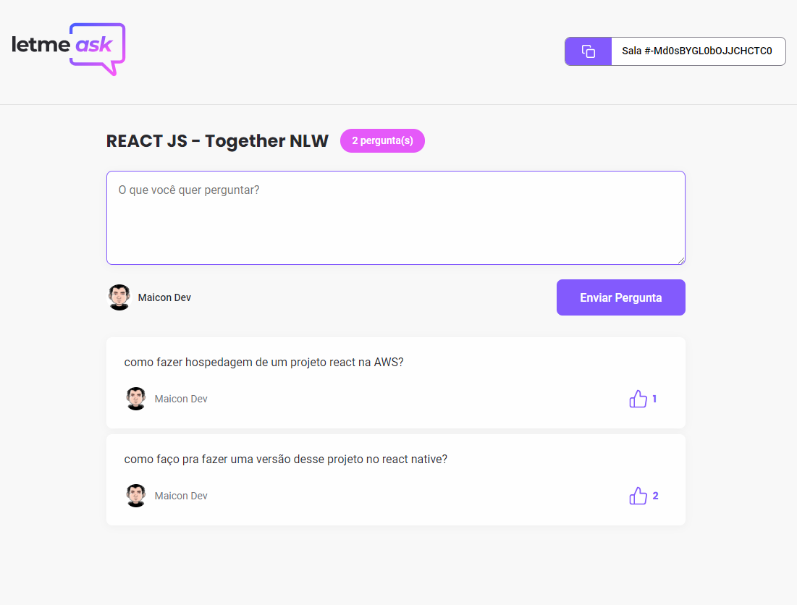

<h1 align="center">
  
</h1>

  <a href="#-tecnologias">Tecnologias</a>&nbsp;&nbsp;&nbsp;|&nbsp;&nbsp;&nbsp;
  <a href="#-projeto">Projeto</a>&nbsp;&nbsp;&nbsp;|&nbsp;&nbsp;&nbsp;
  <a href="#-novidades">Novidades</a>&nbsp;&nbsp;&nbsp;|&nbsp;&nbsp;&nbsp;
  <a href="#-layout">Layout</a>&nbsp;&nbsp;&nbsp;|&nbsp;&nbsp;&nbsp;
  <a href="#-como-executar">Como executar</a>&nbsp;&nbsp;&nbsp;|&nbsp;&nbsp;&nbsp;
  <a href="#-licença">Licença</a>

  

 

 

  

## ✨ Tecnologias

Esse projeto foi desenvolvido com as seguintes tecnologias:

- [React](https://reactjs.org)
- [TypeScript](https://www.typescriptlang.org/)
- [Firebase](https://firebase.google.com/)

## 💻 Projeto

O letmeask é um projeto para Criar salas de Q&A ao vivo e tirar as dúvidas da sua audiência em tempo-real

Use agora mesmo:
1) acesse o site https://letmeask-eta.vercel.app
2) faça o login e crie uma sala com o assunto desejado
3) compartilhe o link para seus público e aguarde as perguntas
4) será possível acompanhar as dúvidas mais curtidas.
5) curta, destaque e responda conforme desejar.

## Novidades em relação ao projeto original

	. Layout
		. Responsividade
		. Cada styles isolado na pasta do componente
		. Componente Loading
		. Favicon
		. Adicionado Page 404 customizada da rocketseat. Adaptado manualmente para TSX e SCSS
		. Cores em variáveis Primary e Secundary, Link
		
	. PWA
		. Add Manifest
		. Logos diversos tamanho
		. Add ServiceWork com Opção de Instalar APP
	
	
	. ROOMS
	  . Componente único de ROOMS compartilhado com ADMIN (aproveitamento de código)
	  . Room Admin protegida
	  . Rota ROOMS mesma Sala Admin (sem necessidade de redirecionamento)
	  . Adicionado o nome e avatar do author da sala
	  . Adicionado instruções para compartilhar o link da sala
	  . Opção de login no google direto da sala
	  . Opção de like 👍 para Admin também (porque não?)
  	. Quando Admin Encerra a sala - usuários são redirecionados automaticamente
	
	
	
	. QUESTIONS
	  . Componente Totalmente isolado de ROOMS
    . Altura maxima definida para cada pergunta (para usuários exagerados) 
    . Cria Scrool customizado quando ultrapassa altura maxima
    . Icones de Opções ampliam e mudam de cor com mouse
    . Limit de 1000 caracteres para novas questões
	
	. Add componente ASIDE para Home e NewRoom
	. Add Hospedagem Vercel

	. Outros
	  . editorconfig
	  . Prettierrc

## 🔖 Layout

Você pode visualizar o layout do projeto através [desse link](https://www.figma.com/file/u0BQK8rCf2KgzcukdRRCWh/Letmeask/duplicate). É necessário ter conta no [Figma](http://figma.com/) para acessá-lo.

## 🚀 Como executar

- Clone o repositório (git clone git@github.com:michaelgomes/letmeask.git)
- Instale as dependências com `yarn`
- Inicie com `yarn start`

Agora você pode acessar [`localhost:3000`](http://localhost:3000) do seu navegador.

## 📄 Licença

Esse projeto está sob a licença MIT. Veja o arquivo [LICENSE](LICENSE.md) para mais detalhes.

---

Feito com ♥ by DevMaicon 👋🏻 [Projeto da semana NLW da Rocketseat](https://nextlevelweek.com/)
